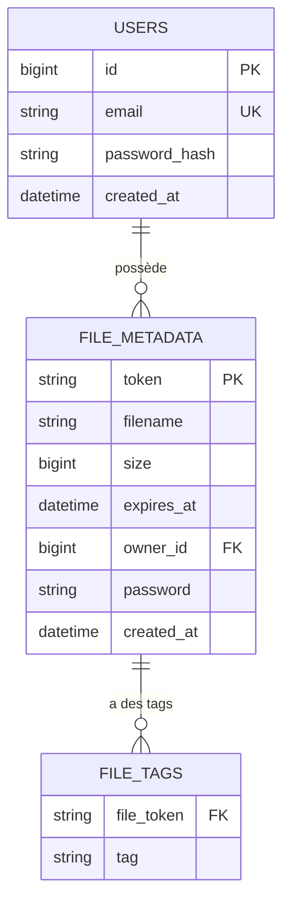

# Documentation Technique

## 1. Architecture globale + interactions

Deux schémas sont fournis:
- `mcd-opc3.jpg`: vue d'ensemble architecture + MCD existant
- `schema-architecture-front-back.svg`: schéma applicatif détaillé en français montrant:
  - l'architecture front Angular
  - les interactions du front avec le back Spring Boot
  - les échanges API REST / JWT
  - les dépendances backend vers PostgreSQL et le stockage local

## 2. Choix technologiques justifiés

| Élément | Technologie choisie | Alternatives | Justification |
|---|---|---|---|
| Frontend | Angular 16 + TypeScript | React, Vue | Structure claire pour formulaires/auth/routing, cohérent pour app monolithique front |
| Backend | Spring Boot 3 + Java 17 | Node.js/Express, .NET | Écosystème robuste API REST, sécurité, tests, intégration JPA |
| Authentification | JWT (JJWT) + filtre Spring Security | Session serveur, OAuth2 complet | Simple pour API stateless, adapté au scope du projet |
| Base de données | PostgreSQL 15 | MySQL, MongoDB | Modèle relationnel adapté (users, metadata fichiers, tags) |
| Persistance | Spring Data JPA | JDBC direct, MyBatis | Productivité et mapping rapide entités/repository |
| Stockage fichier | File system local (`uploads/`) | S3/MinIO | Suffisant pour environnement local/projet de démonstration |
| Tests backend | JUnit 5 + Mockito + Spring Test + JaCoCo | TestNG | Standard Spring, couverture outillée et seuil qualité |
| Tests frontend/e2e | Karma/Jasmine + Cypress | Playwright | Couverture unitaire + parcours utilisateur critiques |
| Perf | k6 + métriques Actuator | JMeter, Gatling | Scriptable, léger et facile à intégrer en local |
| Sécurité outillage | npm audit + Trivy | Snyk, OWASP DC | Outils courants et compatibles CI/local |

### 2.1 Organisation backend en couches
- `controller` : endpoints REST et mapping HTTP
- `service` : logique métier, validations métier, orchestration
- `repository` : accès aux données via Spring Data JPA
- `model` : entités métier persistées
- `dto` : objets d'entrée/sortie de l'API

## 3. Modèle de données

### 3.1 MCD/ERD conforme au code actuel


### 3.2 Notes d'implémentation
- `owner_id` est géré comme identifiant logique de l'utilisateur propriétaire.
- `password` dans `file_metadata` est le hash bcrypt du mot de passe fichier .
- les fichiers physiques sont stockés dans `uploads/` avec nom normalisé: `<token>_<filename_sanitized>`.

## 4. Documentation d'API

La spécification OpenAPI est disponible ici:
- `swagger/openapi.yaml`

Endpoints principaux:
- Auth: `POST /api/auth/register`, `POST /api/auth/login`, `POST /api/auth/logout`
- Utilisateur: `GET /api/me`
- Fichiers: `POST /api/files/upload`, `GET /api/files/history`, `DELETE /api/files/{token}`, `GET /api/files/info/{token}`, `GET /api/files/download/{token}`

## 5. Sécurité et gestion des accès

- Auth JWT stateless (Spring Security + filtre `JwtAuthenticationFilter`).
- Mots de passe utilisateurs hashés en BCrypt.
- Possibilité de protection d'un fichier par mot de passe hashé (BCrypt).
- Blacklist de tokens en mémoire lors du logout.
- Validation entrée côté upload:
  - taille max 1GB
  - extensions interdites: `exe`, `bat`, `cmd`, `sh`
  - expiration max 7 jours
  - mot de passe fichier min 6 caractères
- CORS restreint à `http://localhost:4200`.

Référence détaillée:
- `SECURITY.md`

## 6. Qualité, tests et maintenance

### 6.1 Synthèse qualité/tests
- plan de tests unitaires/intégration/e2e + commandes:
  - `TESTING.md`
- couverture backend avec seuil JaCoCo >= 80%.
- e2e critiques Cypress (auth, upload, download, delete, validations).

### 6.2 Synthèse sécurité
- scans `npm audit` + `trivy fs` + résumés:
  - `SECURITY.md`
  - `reports/security/`

### 6.3 Synthèse performance
- benchmark k6 sur `POST /api/files/upload` + métriques Actuator:
  - `PERF.md`
  - `reports/perf/`

### 6.4 Synthèse maintenance
- procédures de maintenance/correction:
  - `MAINTENANCE.md`

### 6.5 Revue technique du code IA
- revue humaine du code produit avec assistance IA:
  - `AI_CODE_REVIEW.md`

## 7. Processus d'installation et d'exécution

### 7.1 Prérequis
- Docker + Docker Compose
- Node.js (LTS recommandé)
- npm
- Java 17 et Maven (ou exécution Maven via Docker)

### 7.2 Installation/Lancement
Depuis la racine:
```bash
docker compose up -d db backend
cd frontend
npm install
npm start
```

### 7.3 Variables d'environnement principales (backend)
- `DB_HOST`, `DB_PORT`, `DB_NAME`, `DB_USER`, `DB_PASSWORD`
- `JWT_SECRET`
- `JWT_EXPIRATION_MS`

## 8. Utilisation de l'IA dans le développement

Posture utilisée:
- supervision humaine avec répartition explicite des tâches, vérification et comprehension du code implémenté par l'IA avant commit.

Contributions humaines :
- conception des endpoints API,
- conception et implémentation backend Spring Boot selon le modèle:
  - `Controller`
  - `Service`
  - `Repository`
- mise en place de l’authentification JWT et de la logique de sécurité backend.

Tâches confiées à l'IA:
- implémentation principale de la partie frontend Angular,
- génération initiale de tests ciblés (backend/frontend/e2e),
- rédaction et structuration de la documentation technique,
- propositions d'amélioration sur qualité/sécurité/performance.

Supervision et corrections humaines:
- validation fonctionnelle et technique des livrables IA,
- revue de cohérence avec l'architecture backend choisie,
- correction des écarts (schéma de données, contrat API, détail des procédures),
- arbitrage final sur les choix de conception et de sécurité.

Apports constatés:
- gain de temps sur rédaction et cadrage qualité, expertise dont je manque sur la partie frontend.

Limites constatées:
- nécessité de revue manuelle stricte pour éviter les incohérences (ex: schéma MCD théorique non aligné implémentation réelle).

## 9. Vérification de conformité au modèle demandé

| Exigence du modèle | Statut | Référence |
|---|---|---|
| Architecture globale + interactions | Conforme | section 1 |
| Choix technologiques justifiés | Conforme | section 2 |
| Modèle de données documenté | Conforme | section 3 |
| Contrat API documenté (OpenAPI) | Conforme | section 4 + `swagger/openapi.yaml` |
| Sécurité et accès | Conforme | section 5 + `SECURITY.md` |
| Qualité/tests/maintenance (synthèse) | Conforme | section 6 + docs dédiées |
| Processus installation/exécution | Conforme | section 7 |
| Utilisation IA dans le développement | Conforme | section 8 |
