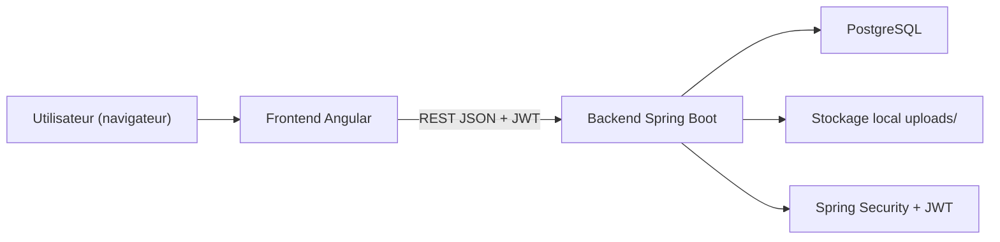
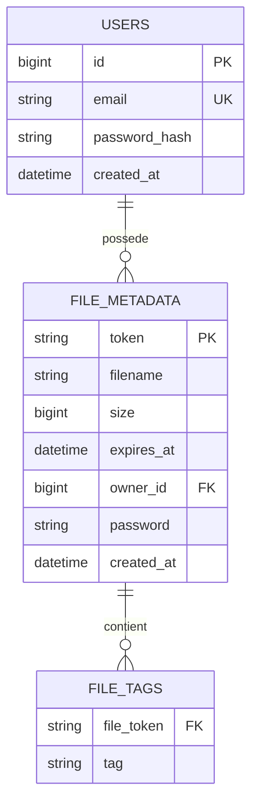

# Schémas corrigés (architecture + modèle de données)

Ce document fournit une version conforme au code actuel du projet.

## Architecture applicative

## MCD / ERD conforme au code actuel

## Écarts corrigés par rapport au schéma initial
- `FILE_METADATA.token` est la clé primaire (pas `id`).
- `TAG` n'est pas une table entité autonome; les tags sont en table de collection `file_tags`.
- pas de champ `is_anonymous` dans l'implémentation actuelle.
- pas de `storage_path` persistant en base.
